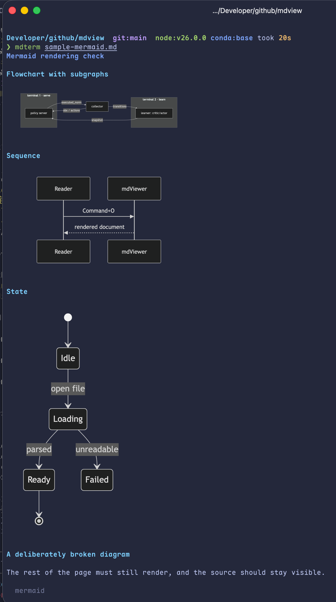

# mdTerminal

Read Markdown in the terminal, with images and LaTeX maths actually rendered.

`glow` prints formulas as raw source. `mdcat` does the same, and is archived.
mdTerminal renders both — images through the Kitty graphics protocol, maths
through MathJax.

<p align="center">
  
</p>

```sh
mdterm notes.md
mdterm ~/research/paper.md
```

## Requirements

A terminal implementing the **Kitty graphics protocol**: Ghostty, Kitty, or
WezTerm. Others still render text, tables, and highlighted code; they just
print placeholders where a picture would go.

Node 20 or newer. No TeX installation, no browser, no Rust.

## Maths

Both delimiter styles work:

| Style | Inline | Display |
| --- | --- | --- |
| Dollar | `$E = mc^2$` | `$$ ... $$` |
| LaTeX-native | `\(E = mc^2\)` | `\[ ... \]` |

The second row matters: notes exported from LaTeX documents and from LLM chats
overwhelmingly use `\(` and `\[`.

**Simple inline maths becomes real text, not a picture.** `$x_o$` renders as
`xₒ` and `$\lambda$` as `λ` — selectable, copyable, and findable with grep. An
image is used only where Unicode cannot express the formula: fractions,
radicals, matrices, and operators carrying limits. A formula is never half text
and half picture, because the two would not share a size or a baseline.

**Prices stay prices.** `$100 and $200` is left alone rather than being read as
a formula, following the rule Pandoc uses: real inline maths never has
whitespace hugging its delimiters.

**Formulas match your terminal.** The colour comes from an OSC 10 query, so
maths is exactly the colour of the text beside it and follows your theme. Size
is derived from your cell height; `--scale` adjusts it.

## Mermaid diagrams

Fenced `mermaid` blocks are drawn as pictures.

Mermaid sizes every node by measuring its rendered label, and only a real
browser measures text correctly — so mdTerminal borrows one. It looks for
Chrome, Chromium, Brave, or Edge already installed on your machine and drives
it headlessly. Nothing is downloaded.

**Without a browser you get the diagram source, syntax-highlighted** — no
error, no missing section.

The first diagram costs roughly three seconds while the browser starts.
Results are cached on disk, so the same document opens instantly next time.

## Options

| Flag | Effect |
| --- | --- |
| `--scale <n>` | Size of rendered maths relative to the text (default 1) |
| `--no-graphics` | Never emit images; print text placeholders |
| `--color <hex>` | Formula colour, overriding the terminal's foreground |
| `-h`, `--help` | Usage |

`MDTERM_BROWSER` names a specific browser binary for diagrams, overriding the
search.

## Install

```sh
npm i -g @horychen/mdterminal
```

Installs both `mdterm` and `mdterminal` as commands — the package name is
scoped, but what you type is not.

Or from a release tarball:

```sh
npm i -g https://github.com/horychen/mdTerminal/releases/latest/download/mdterminal.tgz
```

Or from source:

```sh
git clone https://github.com/horychen/mdTerminal
cd mdTerminal && npm install && npm run build && npm link
```


## In a window instead

[**mdViewer**](https://github.com/horychen/mdViewer) is the sibling of this
project: the same documents — maths, images, and Mermaid diagrams all rendered
— read in a native macOS window rather than a terminal. It has tabs, a
source/preview split, and reader themes, and it draws diagrams without
borrowing a browser, because it already runs in one.

The two share their trickiest piece of logic: the rule that rewrites `\(...\)`
before parsing, and the guard that keeps `$100 and $200` from being read as a
formula.

## Not yet

**A pager.** This release renders a document in one pass; scrolling means your
terminal's own scrollback. Piping to `less` will not carry the images — the
graphics escape sequences do not survive it — so `mdterm` prints text
placeholders whenever its output is not a terminal.

An interactive pager is the next phase, and it will need to implement paging
itself rather than delegate.

## Develop

```sh
npm install
npm test            # unit tests
npm run dev -- file.md
npm run spike       # size and baseline tuning; `-- 1.2` to scale
npm run build
```

## License

MIT
